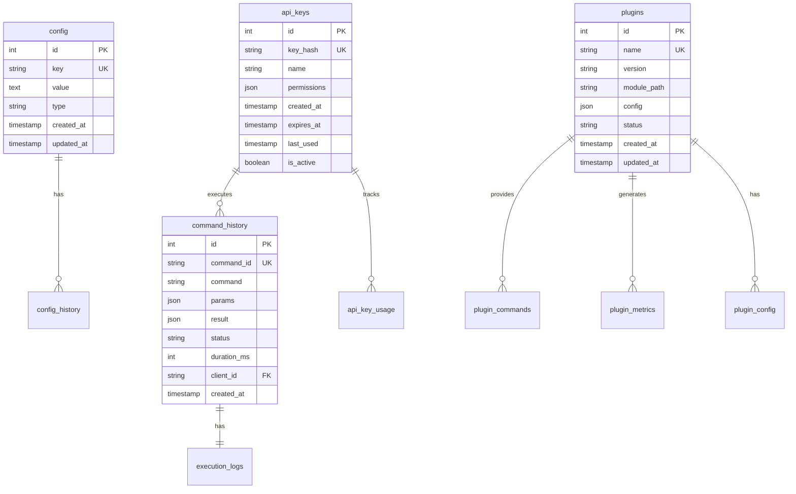

# Database Schema: Waygate MCP

**Version:** 1.0.0
**Database:** SQLite (Development) / PostgreSQL (Production)
**Last Updated:** 2025-01-14
**Author:** Jeremy Longshore

## 1. Database Overview

### 1.1 Database Information
- **Development DB:** SQLite 3.x
- **Production DB:** PostgreSQL 13+
- **Database Name:** waygate_mcp
- **Character Set:** UTF-8
- **Collation:** utf8_general_ci

### 1.2 Design Principles
- Normalized to 3NF where appropriate
- Optimized for read performance
- Audit trails for critical tables
- Soft deletes for data retention
- JSON fields for flexible data

### 1.3 Naming Conventions
- **Tables:** snake_case, plural (e.g., `api_keys`)
- **Columns:** snake_case (e.g., `created_at`)
- **Indexes:** idx_table_column (e.g., `idx_api_keys_hash`)
- **Foreign Keys:** fk_table_reference (e.g., `fk_plugins_creator`)
- **Constraints:** chk_table_constraint (e.g., `chk_metrics_value`)

## 2. Entity Relationship Diagram



## 3. Table Definitions

### 3.1 config
**Purpose:** Store system configuration parameters

```sql
CREATE TABLE config (
    id INTEGER PRIMARY KEY AUTOINCREMENT,
    key TEXT UNIQUE NOT NULL,
    value TEXT NOT NULL,
    type TEXT NOT NULL CHECK (type IN ('string', 'integer', 'boolean', 'json')),
    description TEXT,
    is_sensitive BOOLEAN DEFAULT FALSE,
    created_at TIMESTAMP DEFAULT CURRENT_TIMESTAMP,
    updated_at TIMESTAMP DEFAULT CURRENT_TIMESTAMP,
    updated_by TEXT
);

-- Indexes
CREATE UNIQUE INDEX idx_config_key ON config(key);
CREATE INDEX idx_config_type ON config(type);

-- Sample Data
INSERT INTO config (key, value, type, description) VALUES
('max_request_size', '10485760', 'integer', 'Maximum request size in bytes'),
('rate_limit_enabled', 'true', 'boolean', 'Enable rate limiting'),
('default_timeout', '30', 'integer', 'Default command timeout in seconds');
```

### 3.2 config_history
**Purpose:** Audit trail for configuration changes

```sql
CREATE TABLE config_history (
    id INTEGER PRIMARY KEY AUTOINCREMENT,
    config_id INTEGER NOT NULL,
    key TEXT NOT NULL,
    old_value TEXT,
    new_value TEXT,
    changed_by TEXT NOT NULL,
    change_reason TEXT,
    changed_at TIMESTAMP DEFAULT CURRENT_TIMESTAMP,
    FOREIGN KEY (config_id) REFERENCES config(id)
);

-- Indexes
CREATE INDEX idx_config_history_config_id ON config_history(config_id);
CREATE INDEX idx_config_history_changed_at ON config_history(changed_at);
```

### 3.3 api_keys
**Purpose:** API authentication and authorization

```sql
CREATE TABLE api_keys (
    id INTEGER PRIMARY KEY AUTOINCREMENT,
    key_hash TEXT UNIQUE NOT NULL,
    key_prefix TEXT NOT NULL, -- First 8 chars for identification
    name TEXT NOT NULL,
    description TEXT,
    permissions JSON NOT NULL DEFAULT '["read"]',
    rate_limit INTEGER DEFAULT 100,
    created_at TIMESTAMP DEFAULT CURRENT_TIMESTAMP,
    created_by TEXT NOT NULL,
    expires_at TIMESTAMP,
    last_used TIMESTAMP,
    is_active BOOLEAN DEFAULT TRUE,
    revoked_at TIMESTAMP,
    revoked_by TEXT,
    revoke_reason TEXT
);

-- Indexes
CREATE UNIQUE INDEX idx_api_keys_hash ON api_keys(key_hash);
CREATE INDEX idx_api_keys_prefix ON api_keys(key_prefix);
CREATE INDEX idx_api_keys_active ON api_keys(is_active);
CREATE INDEX idx_api_keys_expires ON api_keys(expires_at);

-- Trigger to update last_used
CREATE TRIGGER update_api_key_last_used
AFTER UPDATE ON api_keys
WHEN NEW.last_used != OLD.last_used
BEGIN
    UPDATE api_key_usage
    SET last_used = NEW.last_used
    WHERE api_key_id = NEW.id;
END;
```

### 3.4 api_key_usage
**Purpose:** Track API key usage statistics

```sql
CREATE TABLE api_key_usage (
    id INTEGER PRIMARY KEY AUTOINCREMENT,
    api_key_id INTEGER NOT NULL,
    date DATE NOT NULL,
    request_count INTEGER DEFAULT 0,
    error_count INTEGER DEFAULT 0,
    total_duration_ms INTEGER DEFAULT 0,
    unique_commands INTEGER DEFAULT 0,
    FOREIGN KEY (api_key_id) REFERENCES api_keys(id),
    UNIQUE(api_key_id, date)
);

-- Indexes
CREATE INDEX idx_api_key_usage_key_date ON api_key_usage(api_key_id, date);
CREATE INDEX idx_api_key_usage_date ON api_key_usage(date);
```

### 3.5 plugins
**Purpose:** Plugin registry and management

```sql
CREATE TABLE plugins (
    id INTEGER PRIMARY KEY AUTOINCREMENT,
    name TEXT UNIQUE NOT NULL,
    display_name TEXT NOT NULL,
    version TEXT NOT NULL,
    description TEXT,
    author TEXT,
    module_path TEXT NOT NULL,
    config JSON DEFAULT '{}',
    capabilities JSON DEFAULT '[]',
    dependencies JSON DEFAULT '[]',
    status TEXT DEFAULT 'inactive' CHECK (status IN ('active', 'inactive', 'error', 'loading')),
    error_message TEXT,
    installed_at TIMESTAMP DEFAULT CURRENT_TIMESTAMP,
    installed_by TEXT,
    updated_at TIMESTAMP DEFAULT CURRENT_TIMESTAMP,
    last_loaded TIMESTAMP,
    load_count INTEGER DEFAULT 0,
    error_count INTEGER DEFAULT 0
);

-- Indexes
CREATE UNIQUE INDEX idx_plugins_name ON plugins(name);
CREATE INDEX idx_plugins_status ON plugins(status);
CREATE INDEX idx_plugins_author ON plugins(author);
```

### 3.6 plugin_config
**Purpose:** Plugin-specific configuration

```sql
CREATE TABLE plugin_config (
    id INTEGER PRIMARY KEY AUTOINCREMENT,
    plugin_id INTEGER NOT NULL,
    config_key TEXT NOT NULL,
    config_value TEXT,
    value_type TEXT CHECK (value_type IN ('string', 'integer', 'boolean', 'json')),
    is_required BOOLEAN DEFAULT FALSE,
    is_sensitive BOOLEAN DEFAULT FALSE,
    created_at TIMESTAMP DEFAULT CURRENT_TIMESTAMP,
    updated_at TIMESTAMP DEFAULT CURRENT_TIMESTAMP,
    FOREIGN KEY (plugin_id) REFERENCES plugins(id) ON DELETE CASCADE,
    UNIQUE(plugin_id, config_key)
);

-- Indexes
CREATE INDEX idx_plugin_config_plugin ON plugin_config(plugin_id);
```

### 3.7 plugin_commands
**Purpose:** Commands provided by plugins

```sql
CREATE TABLE plugin_commands (
    id INTEGER PRIMARY KEY AUTOINCREMENT,
    plugin_id INTEGER NOT NULL,
    command_name TEXT NOT NULL,
    description TEXT,
    parameters JSON,
    return_type TEXT,
    is_async BOOLEAN DEFAULT FALSE,
    timeout_seconds INTEGER DEFAULT 30,
    created_at TIMESTAMP DEFAULT CURRENT_TIMESTAMP,
    FOREIGN KEY (plugin_id) REFERENCES plugins(id) ON DELETE CASCADE,
    UNIQUE(plugin_id, command_name)
);

-- Indexes
CREATE INDEX idx_plugin_commands_plugin ON plugin_commands(plugin_id);
CREATE INDEX idx_plugin_commands_name ON plugin_commands(command_name);
```

### 3.8 command_history
**Purpose:** Audit trail of all executed commands

```sql
CREATE TABLE command_history (
    id INTEGER PRIMARY KEY AUTOINCREMENT,
    command_id TEXT UNIQUE NOT NULL,
    command TEXT NOT NULL,
    params JSON,
    result JSON,
    error_message TEXT,
    status TEXT NOT NULL CHECK (status IN ('pending', 'executing', 'success', 'failed', 'timeout')),
    duration_ms INTEGER,
    api_key_id INTEGER,
    plugin_id INTEGER,
    client_ip TEXT,
    user_agent TEXT,
    created_at TIMESTAMP DEFAULT CURRENT_TIMESTAMP,
    completed_at TIMESTAMP,
    FOREIGN KEY (api_key_id) REFERENCES api_keys(id),
    FOREIGN KEY (plugin_id) REFERENCES plugins(id)
);

-- Indexes
CREATE UNIQUE INDEX idx_command_history_command_id ON command_history(command_id);
CREATE INDEX idx_command_history_status ON command_history(status);
CREATE INDEX idx_command_history_created ON command_history(created_at);
CREATE INDEX idx_command_history_api_key ON command_history(api_key_id);
CREATE INDEX idx_command_history_plugin ON command_history(plugin_id);
```

### 3.9 execution_logs
**Purpose:** Detailed execution logs for debugging

```sql
CREATE TABLE execution_logs (
    id INTEGER PRIMARY KEY AUTOINCREMENT,
    command_history_id INTEGER NOT NULL,
    log_level TEXT CHECK (log_level IN ('DEBUG', 'INFO', 'WARNING', 'ERROR', 'CRITICAL')),
    message TEXT NOT NULL,
    context JSON,
    timestamp TIMESTAMP DEFAULT CURRENT_TIMESTAMP,
    FOREIGN KEY (command_history_id) REFERENCES command_history(id) ON DELETE CASCADE
);

-- Indexes
CREATE INDEX idx_execution_logs_command ON execution_logs(command_history_id);
CREATE INDEX idx_execution_logs_level ON execution_logs(log_level);
CREATE INDEX idx_execution_logs_timestamp ON execution_logs(timestamp);
```

### 3.10 metrics
**Purpose:** System and business metrics

```sql
CREATE TABLE metrics (
    id INTEGER PRIMARY KEY AUTOINCREMENT,
    metric_name TEXT NOT NULL,
    metric_value REAL NOT NULL,
    metric_type TEXT CHECK (metric_type IN ('counter', 'gauge', 'histogram', 'summary')),
    tags JSON DEFAULT '{}',
    timestamp TIMESTAMP DEFAULT CURRENT_TIMESTAMP,
    CHECK (metric_value >= 0 OR metric_type = 'gauge')
);

-- Indexes
CREATE INDEX idx_metrics_name_time ON metrics(metric_name, timestamp);
CREATE INDEX idx_metrics_timestamp ON metrics(timestamp);
CREATE INDEX idx_metrics_type ON metrics(metric_type);

-- Partitioning for PostgreSQL (monthly)
-- CREATE TABLE metrics_2025_01 PARTITION OF metrics
-- FOR VALUES FROM ('2025-01-01') TO ('2025-02-01');
```

### 3.11 plugin_metrics
**Purpose:** Plugin-specific metrics

```sql
CREATE TABLE plugin_metrics (
    id INTEGER PRIMARY KEY AUTOINCREMENT,
    plugin_id INTEGER NOT NULL,
    metric_name TEXT NOT NULL,
    metric_value REAL NOT NULL,
    timestamp TIMESTAMP DEFAULT CURRENT_TIMESTAMP,
    FOREIGN KEY (plugin_id) REFERENCES plugins(id) ON DELETE CASCADE
);

-- Indexes
CREATE INDEX idx_plugin_metrics_plugin ON plugin_metrics(plugin_id);
CREATE INDEX idx_plugin_metrics_name ON plugin_metrics(metric_name);
CREATE INDEX idx_plugin_metrics_timestamp ON plugin_metrics(timestamp);
```

### 3.12 system_events
**Purpose:** System-wide event logging

```sql
CREATE TABLE system_events (
    id INTEGER PRIMARY KEY AUTOINCREMENT,
    event_type TEXT NOT NULL,
    event_name TEXT NOT NULL,
    description TEXT,
    severity TEXT CHECK (severity IN ('info', 'warning', 'error', 'critical')),
    source TEXT,
    context JSON,
    created_at TIMESTAMP DEFAULT CURRENT_TIMESTAMP
);

-- Indexes
CREATE INDEX idx_system_events_type ON system_events(event_type);
CREATE INDEX idx_system_events_severity ON system_events(severity);
CREATE INDEX idx_system_events_created ON system_events(created_at);
```

## 4. Views

### 4.1 v_active_api_keys
**Purpose:** Active API keys with usage statistics

```sql
CREATE VIEW v_active_api_keys AS
SELECT
    ak.id,
    ak.name,
    ak.key_prefix,
    ak.permissions,
    ak.created_at,
    ak.expires_at,
    ak.last_used,
    COUNT(ch.id) as total_requests,
    AVG(ch.duration_ms) as avg_duration_ms
FROM api_keys ak
LEFT JOIN command_history ch ON ak.id = ch.api_key_id
WHERE ak.is_active = TRUE
  AND (ak.expires_at IS NULL OR ak.expires_at > CURRENT_TIMESTAMP)
GROUP BY ak.id;
```

### 4.2 v_plugin_performance
**Purpose:** Plugin performance metrics

```sql
CREATE VIEW v_plugin_performance AS
SELECT
    p.id,
    p.name,
    p.version,
    p.status,
    COUNT(ch.id) as execution_count,
    AVG(ch.duration_ms) as avg_duration_ms,
    MAX(ch.duration_ms) as max_duration_ms,
    MIN(ch.duration_ms) as min_duration_ms,
    SUM(CASE WHEN ch.status = 'failed' THEN 1 ELSE 0 END) as error_count,
    ROUND(100.0 * SUM(CASE WHEN ch.status = 'success' THEN 1 ELSE 0 END) / COUNT(ch.id), 2) as success_rate
FROM plugins p
LEFT JOIN command_history ch ON p.id = ch.plugin_id
WHERE ch.created_at > datetime('now', '-7 days')
GROUP BY p.id;
```

## 5. Stored Procedures (PostgreSQL)

### 5.1 sp_rotate_api_key
**Purpose:** Rotate an API key

```sql
CREATE OR REPLACE FUNCTION sp_rotate_api_key(
    p_old_key_hash TEXT,
    p_new_key_hash TEXT,
    p_new_key_prefix TEXT,
    p_rotated_by TEXT
)
RETURNS TABLE(success BOOLEAN, message TEXT) AS $$
BEGIN
    -- Deactivate old key
    UPDATE api_keys
    SET is_active = FALSE,
        revoked_at = CURRENT_TIMESTAMP,
        revoked_by = p_rotated_by,
        revoke_reason = 'Key rotation'
    WHERE key_hash = p_old_key_hash;

    -- Create new key with same permissions
    INSERT INTO api_keys (key_hash, key_prefix, name, permissions, created_by)
    SELECT p_new_key_hash, p_new_key_prefix, name || ' (rotated)', permissions, p_rotated_by
    FROM api_keys
    WHERE key_hash = p_old_key_hash;

    RETURN QUERY SELECT TRUE, 'Key rotated successfully';
EXCEPTION
    WHEN OTHERS THEN
        RETURN QUERY SELECT FALSE, SQLERRM;
END;
$$ LANGUAGE plpgsql;
```

## 6. Triggers

### 6.1 Update Timestamps
**Purpose:** Automatically update timestamps

```sql
-- SQLite version
CREATE TRIGGER update_config_timestamp
AFTER UPDATE ON config
BEGIN
    UPDATE config SET updated_at = CURRENT_TIMESTAMP WHERE id = NEW.id;
END;

-- PostgreSQL version
CREATE OR REPLACE FUNCTION update_timestamp()
RETURNS TRIGGER AS $$
BEGIN
    NEW.updated_at = CURRENT_TIMESTAMP;
    RETURN NEW;
END;
$$ LANGUAGE plpgsql;

CREATE TRIGGER update_config_timestamp
BEFORE UPDATE ON config
FOR EACH ROW
EXECUTE FUNCTION update_timestamp();
```

## 7. Indexes Strategy

### 7.1 Index Guidelines
- Primary keys: Automatic index
- Foreign keys: Always indexed
- Frequently queried columns: Indexed
- Timestamp columns for range queries: Indexed
- JSON columns: Use GIN indexes (PostgreSQL)

### 7.2 Performance Indexes

```sql
-- Composite indexes for common queries
CREATE INDEX idx_command_history_api_created
ON command_history(api_key_id, created_at DESC);

CREATE INDEX idx_metrics_name_type_time
ON metrics(metric_name, metric_type, timestamp DESC);

-- Partial indexes for filtered queries
CREATE INDEX idx_active_plugins
ON plugins(name) WHERE status = 'active';

-- JSON indexes (PostgreSQL)
CREATE INDEX idx_config_json
ON plugins USING GIN (config);
```

## 8. Data Migration

### 8.1 SQLite to PostgreSQL Migration

```sql
-- Export from SQLite
.output waygate_export.sql
.dump

-- Import to PostgreSQL
psql waygate_mcp < waygate_export.sql

-- Fix sequences
SELECT setval('config_id_seq', (SELECT MAX(id) FROM config));
SELECT setval('api_keys_id_seq', (SELECT MAX(id) FROM api_keys));
-- ... repeat for all tables
```

## 9. Maintenance Queries

### 9.1 Cleanup Old Data

```sql
-- Delete old command history (keep 90 days)
DELETE FROM command_history
WHERE created_at < datetime('now', '-90 days');

-- Delete old metrics (keep 30 days)
DELETE FROM metrics
WHERE timestamp < datetime('now', '-30 days');

-- Archive old execution logs
INSERT INTO execution_logs_archive
SELECT * FROM execution_logs
WHERE timestamp < datetime('now', '-60 days');

DELETE FROM execution_logs
WHERE timestamp < datetime('now', '-60 days');
```

### 9.2 Database Statistics

```sql
-- Table sizes
SELECT
    name as table_name,
    COUNT(*) as row_count
FROM sqlite_master
WHERE type = 'table'
GROUP BY name;

-- Database size (PostgreSQL)
SELECT pg_database_size('waygate_mcp') / 1024 / 1024 as size_mb;
```

## 10. Backup and Recovery

### 10.1 Backup Commands

```bash
# SQLite backup
sqlite3 waygate.db ".backup waygate_backup.db"

# PostgreSQL backup
pg_dump waygate_mcp > waygate_backup.sql
pg_dump waygate_mcp -Fc > waygate_backup.dump
```

### 10.2 Recovery Commands

```bash
# SQLite recovery
cp waygate_backup.db waygate.db

# PostgreSQL recovery
psql waygate_mcp < waygate_backup.sql
pg_restore -d waygate_mcp waygate_backup.dump
```

---

**Document Status:** Complete
**Schema Version:** 1.0.0
**Compatible With:** SQLite 3.x, PostgreSQL 13+