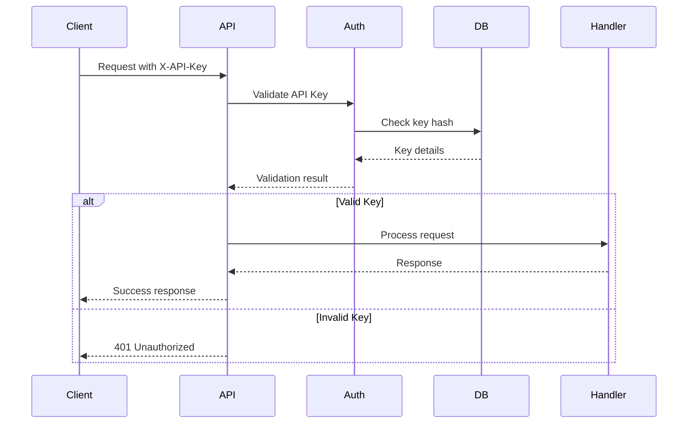

# Technical Specification: Waygate MCP Framework

**Version:** 1.0.0
**Date:** 2025-01-14
**Author:** Jeremy Longshore
**Status:** Draft
**Related PRD:** PRD-00-waygate-mcp-framework

## 1. Overview

### 1.1 Purpose
This document provides the detailed technical specification for implementing the Waygate MCP Framework, an enterprise-grade Model Context Protocol server that replaces NEXUS MCP.

### 1.2 Scope
- Core MCP server implementation
- Plugin architecture
- Diagnostic tools
- Monitoring and observability
- Security implementation
- Deployment patterns

### 1.3 Assumptions
- Python 3.9+ environment available
- Ubuntu 20.04+ or compatible Linux
- 1GB+ available disk space
- Network connectivity for package installation

## 2. System Architecture

### 2.1 High-Level Architecture

```
┌─────────────────────────────────────────────────┐
│                    Clients                       │
│         (AI Assistants, Tools, APIs)            │
└─────────────────┬───────────────────────────────┘
                  │ HTTPS/WSS
┌─────────────────▼───────────────────────────────┐
│              API Gateway Layer                   │
│         (FastAPI + Uvicorn/Gunicorn)            │
├──────────────────────────────────────────────────┤
│            Core Services Layer                   │
│  ┌──────────┐  ┌──────────┐  ┌──────────────┐ │
│  │   MCP    │  │  Plugin  │  │  Diagnostic  │ │
│  │  Engine  │  │  Manager │  │   Services   │ │
│  └──────────┘  └──────────┘  └──────────────┘ │
├──────────────────────────────────────────────────┤
│             Data Access Layer                    │
│  ┌──────────┐  ┌──────────┐  ┌──────────────┐ │
│  │  SQLite  │  │  Cache   │  │   Config     │ │
│  │    DB    │  │  (Redis) │  │   Store      │ │
│  └──────────┘  └──────────┘  └──────────────┘ │
├──────────────────────────────────────────────────┤
│          Observability Layer                     │
│  ┌──────────┐  ┌──────────┐  ┌──────────────┐ │
│  │ Metrics  │  │  Tracing │  │   Logging    │ │
│  │(Prometh) │  │ (OTel)   │  │ (structlog)  │ │
│  └──────────┘  └──────────┘  └──────────────┘ │
└──────────────────────────────────────────────────┘
```

### 2.2 Component Architecture

```python
# Component hierarchy
waygate_mcp/
├── core/
│   ├── server.py         # Main server class
│   ├── config.py         # Configuration management
│   └── exceptions.py     # Custom exceptions
├── api/
│   ├── routes/           # API route definitions
│   ├── middleware/       # Custom middleware
│   └── dependencies.py   # Dependency injection
├── mcp/
│   ├── protocol.py       # MCP protocol implementation
│   ├── executor.py       # Command execution
│   └── validator.py      # Message validation
├── plugins/
│   ├── base.py          # Plugin base class
│   ├── loader.py        # Plugin loading
│   └── registry.py      # Plugin registry
├── diagnostics/
│   ├── health.py        # Health checks
│   ├── performance.py   # Performance monitoring
│   └── analyzer.py      # Log analysis
└── utils/
    ├── logging.py       # Logging utilities
    ├── metrics.py       # Metrics collection
    └── security.py      # Security utilities
```

## 3. Data Models

### 3.1 Database Schema

```sql
-- Configuration table
CREATE TABLE config (
    id INTEGER PRIMARY KEY AUTOINCREMENT,
    key TEXT UNIQUE NOT NULL,
    value TEXT NOT NULL,
    type TEXT NOT NULL,
    created_at TIMESTAMP DEFAULT CURRENT_TIMESTAMP,
    updated_at TIMESTAMP DEFAULT CURRENT_TIMESTAMP
);

-- API keys table
CREATE TABLE api_keys (
    id INTEGER PRIMARY KEY AUTOINCREMENT,
    key_hash TEXT UNIQUE NOT NULL,
    name TEXT NOT NULL,
    permissions TEXT NOT NULL,
    created_at TIMESTAMP DEFAULT CURRENT_TIMESTAMP,
    expires_at TIMESTAMP,
    last_used TIMESTAMP,
    is_active BOOLEAN DEFAULT TRUE
);

-- Plugin registry table
CREATE TABLE plugins (
    id INTEGER PRIMARY KEY AUTOINCREMENT,
    name TEXT UNIQUE NOT NULL,
    version TEXT NOT NULL,
    module_path TEXT NOT NULL,
    config JSON,
    status TEXT DEFAULT 'inactive',
    created_at TIMESTAMP DEFAULT CURRENT_TIMESTAMP,
    updated_at TIMESTAMP DEFAULT CURRENT_TIMESTAMP
);

-- Command history table
CREATE TABLE command_history (
    id INTEGER PRIMARY KEY AUTOINCREMENT,
    command TEXT NOT NULL,
    params JSON,
    result JSON,
    status TEXT NOT NULL,
    duration_ms INTEGER,
    client_id TEXT,
    created_at TIMESTAMP DEFAULT CURRENT_TIMESTAMP
);

-- Metrics table
CREATE TABLE metrics (
    id INTEGER PRIMARY KEY AUTOINCREMENT,
    metric_name TEXT NOT NULL,
    metric_value REAL NOT NULL,
    tags JSON,
    timestamp TIMESTAMP DEFAULT CURRENT_TIMESTAMP
);
```

### 3.2 API Models (Pydantic)

```python
from pydantic import BaseModel, Field
from typing import Optional, Dict, Any, List
from datetime import datetime
from enum import Enum

class CommandStatus(str, Enum):
    PENDING = "pending"
    EXECUTING = "executing"
    SUCCESS = "success"
    FAILED = "failed"
    TIMEOUT = "timeout"

class MCPCommand(BaseModel):
    action: str = Field(..., description="Command action")
    params: Dict[str, Any] = Field(default={}, description="Command parameters")
    context: Optional[Dict[str, Any]] = Field(None, description="Execution context")
    timeout: Optional[int] = Field(30, description="Timeout in seconds")

class MCPResponse(BaseModel):
    status: CommandStatus
    result: Optional[Any] = None
    error: Optional[str] = None
    duration_ms: int
    command_id: str

class PluginInfo(BaseModel):
    name: str
    version: str
    description: str
    author: str
    capabilities: List[str]
    config_schema: Optional[Dict[str, Any]] = None

class HealthCheck(BaseModel):
    status: str  # healthy, degraded, unhealthy
    checks: Dict[str, str]
    version: str
    uptime_seconds: int
    timestamp: datetime

class MetricData(BaseModel):
    name: str
    value: float
    tags: Dict[str, str] = {}
    timestamp: datetime = Field(default_factory=datetime.utcnow)
```

## 4. API Specification

### 4.1 REST Endpoints

```yaml
openapi: 3.0.0
info:
  title: Waygate MCP API
  version: 2.0.0

paths:
  /:
    get:
      summary: Root endpoint
      responses:
        200:
          description: Service information
          content:
            application/json:
              schema:
                type: object
                properties:
                  service: string
                  version: string
                  status: string
                  mode: string

  /health:
    get:
      summary: Health check
      responses:
        200:
          description: Health status
          content:
            application/json:
              schema:
                $ref: '#/components/schemas/HealthCheck'

  /mcp/execute:
    post:
      summary: Execute MCP command
      security:
        - ApiKeyAuth: []
      requestBody:
        required: true
        content:
          application/json:
            schema:
              $ref: '#/components/schemas/MCPCommand'
      responses:
        200:
          description: Command result
          content:
            application/json:
              schema:
                $ref: '#/components/schemas/MCPResponse'

  /plugins:
    get:
      summary: List plugins
      responses:
        200:
          description: Plugin list
          content:
            application/json:
              schema:
                type: array
                items:
                  $ref: '#/components/schemas/PluginInfo'

  /metrics:
    get:
      summary: Prometheus metrics
      responses:
        200:
          description: Metrics in Prometheus format
          content:
            text/plain:
              schema:
                type: string

components:
  securitySchemes:
    ApiKeyAuth:
      type: apiKey
      in: header
      name: X-API-Key
```

## 5. Security Specification

### 5.1 Authentication Flow



### 5.2 Security Implementation

```python
# Security middleware
from fastapi import HTTPException, Security, status
from fastapi.security import APIKeyHeader
import hashlib
import hmac

api_key_header = APIKeyHeader(name="X-API-Key")

async def verify_api_key(api_key: str = Security(api_key_header)):
    # Hash the provided key
    key_hash = hashlib.sha256(api_key.encode()).hexdigest()

    # Check against database
    stored_key = await db.get_api_key(key_hash)

    if not stored_key or not stored_key.is_active:
        raise HTTPException(
            status_code=status.HTTP_401_UNAUTHORIZED,
            detail="Invalid or inactive API key"
        )

    # Check expiration
    if stored_key.expires_at and stored_key.expires_at < datetime.utcnow():
        raise HTTPException(
            status_code=status.HTTP_401_UNAUTHORIZED,
            detail="API key expired"
        )

    # Update last used
    await db.update_last_used(key_hash)

    return stored_key

# Rate limiting
from slowapi import Limiter
from slowapi.util import get_remote_address

limiter = Limiter(key_func=get_remote_address)

@app.post("/mcp/execute")
@limiter.limit("100/minute")
async def execute_command(
    command: MCPCommand,
    api_key: dict = Depends(verify_api_key)
):
    # Process command
    pass
```

## 6. Plugin Architecture

### 6.1 Plugin Interface

```python
from abc import ABC, abstractmethod
from typing import Dict, Any, Optional

class MCPPlugin(ABC):
    """Base class for all MCP plugins"""

    def __init__(self, config: Dict[str, Any]):
        self.config = config
        self.name = self.__class__.__name__
        self.version = "1.0.0"

    @abstractmethod
    async def initialize(self) -> None:
        """Initialize plugin resources"""
        pass

    @abstractmethod
    async def execute(self, command: str, params: Dict[str, Any]) -> Any:
        """Execute plugin command"""
        pass

    @abstractmethod
    async def shutdown(self) -> None:
        """Clean up plugin resources"""
        pass

    @property
    @abstractmethod
    def capabilities(self) -> List[str]:
        """List of capabilities this plugin provides"""
        pass

    async def health_check(self) -> Dict[str, str]:
        """Plugin health check"""
        return {"status": "healthy"}
```

### 6.2 Plugin Loader

```python
import importlib
import inspect
from pathlib import Path

class PluginLoader:
    def __init__(self, plugin_dir: Path):
        self.plugin_dir = plugin_dir
        self.plugins = {}

    async def discover_plugins(self):
        """Discover and load plugins"""
        for plugin_file in self.plugin_dir.glob("*.py"):
            if plugin_file.name.startswith("_"):
                continue

            module_name = plugin_file.stem
            spec = importlib.util.spec_from_file_location(
                module_name, plugin_file
            )
            module = importlib.util.module_from_spec(spec)
            spec.loader.exec_module(module)

            # Find plugin classes
            for name, obj in inspect.getmembers(module):
                if (inspect.isclass(obj) and
                    issubclass(obj, MCPPlugin) and
                    obj != MCPPlugin):
                    await self.register_plugin(name, obj)

    async def register_plugin(self, name: str, plugin_class: type):
        """Register a plugin"""
        config = await self.load_plugin_config(name)
        plugin = plugin_class(config)
        await plugin.initialize()
        self.plugins[name] = plugin
```

## 7. Monitoring & Observability

### 7.1 Metrics Collection

```python
from prometheus_client import Counter, Histogram, Gauge, generate_latest

# Define metrics
request_count = Counter(
    'waygate_requests_total',
    'Total number of requests',
    ['method', 'endpoint', 'status']
)

request_duration = Histogram(
    'waygate_request_duration_seconds',
    'Request duration in seconds',
    ['method', 'endpoint']
)

active_connections = Gauge(
    'waygate_active_connections',
    'Number of active connections'
)

plugin_execution_time = Histogram(
    'waygate_plugin_execution_seconds',
    'Plugin execution time',
    ['plugin', 'command']
)

# Metrics endpoint
@app.get("/metrics")
async def metrics():
    return Response(generate_latest(), media_type="text/plain")
```

### 7.2 Distributed Tracing

```python
from opentelemetry import trace
from opentelemetry.exporter.otlp.proto.grpc.trace_exporter import OTLPSpanExporter
from opentelemetry.sdk.trace import TracerProvider
from opentelemetry.sdk.trace.export import BatchSpanProcessor

# Configure tracing
trace.set_tracer_provider(TracerProvider())
tracer = trace.get_tracer(__name__)

otlp_exporter = OTLPSpanExporter(endpoint="localhost:4317")
span_processor = BatchSpanProcessor(otlp_exporter)
trace.get_tracer_provider().add_span_processor(span_processor)

# Use in code
async def execute_mcp_command(command: MCPCommand):
    with tracer.start_as_current_span("execute_command") as span:
        span.set_attribute("command.action", command.action)
        span.set_attribute("command.params", str(command.params))

        try:
            result = await mcp_engine.execute(command)
            span.set_attribute("command.status", "success")
            return result
        except Exception as e:
            span.record_exception(e)
            span.set_attribute("command.status", "failed")
            raise
```

## 8. Deployment Configuration

### 8.1 Docker Configuration

```dockerfile
# Dockerfile
FROM python:3.9-slim

WORKDIR /app

# Install system dependencies
RUN apt-get update && apt-get install -y \
    gcc \
    && rm -rf /var/lib/apt/lists/*

# Copy requirements
COPY requirements.txt .
RUN pip install --no-cache-dir -r requirements.txt

# Copy application
COPY src/ ./src/
COPY configs/ ./configs/

# Create non-root user
RUN useradd -m -u 1000 waygate && chown -R waygate:waygate /app
USER waygate

# Health check
HEALTHCHECK --interval=30s --timeout=3s --start-period=5s \
    CMD python -c "import requests; requests.get('http://localhost:8000/health')"

# Run application
CMD ["uvicorn", "src.waygate_mcp:app", "--host", "0.0.0.0", "--port", "8000"]
```

### 8.2 Kubernetes Deployment

```yaml
# k8s/deployment.yaml
apiVersion: apps/v1
kind: Deployment
metadata:
  name: waygate-mcp
  labels:
    app: waygate-mcp
spec:
  replicas: 3
  selector:
    matchLabels:
      app: waygate-mcp
  template:
    metadata:
      labels:
        app: waygate-mcp
    spec:
      containers:
      - name: waygate
        image: waygate-mcp:latest
        ports:
        - containerPort: 8000
        env:
        - name: WAYGATE_ENV
          value: "production"
        resources:
          requests:
            memory: "256Mi"
            cpu: "250m"
          limits:
            memory: "512Mi"
            cpu: "500m"
        livenessProbe:
          httpGet:
            path: /health
            port: 8000
          initialDelaySeconds: 30
          periodSeconds: 10
        readinessProbe:
          httpGet:
            path: /ready
            port: 8000
          initialDelaySeconds: 5
          periodSeconds: 5
```

## 9. Testing Strategy

### 9.1 Unit Testing

```python
# tests/test_mcp_engine.py
import pytest
from src.mcp.engine import MCPEngine
from src.mcp.protocol import MCPCommand

@pytest.fixture
def mcp_engine():
    return MCPEngine()

@pytest.mark.asyncio
async def test_execute_command(mcp_engine):
    command = MCPCommand(
        action="test",
        params={"key": "value"}
    )

    result = await mcp_engine.execute(command)

    assert result.status == "success"
    assert result.result is not None

@pytest.mark.asyncio
async def test_invalid_command(mcp_engine):
    command = MCPCommand(
        action="invalid_action",
        params={}
    )

    with pytest.raises(ValueError):
        await mcp_engine.execute(command)
```

### 9.2 Integration Testing

```python
# tests/test_integration.py
from fastapi.testclient import TestClient
from src.waygate_mcp import app

client = TestClient(app)

def test_health_endpoint():
    response = client.get("/health")
    assert response.status_code == 200
    assert response.json()["status"] == "healthy"

def test_mcp_execution():
    response = client.post(
        "/mcp/execute",
        json={"action": "test", "params": {}},
        headers={"X-API-Key": "test-key"}
    )
    assert response.status_code == 200
    assert response.json()["status"] == "success"
```

## 10. Performance Specifications

### 10.1 Performance Targets

| Metric | Target | Measurement Method |
|--------|--------|-------------------|
| Response Time (p50) | < 50ms | Prometheus histogram |
| Response Time (p95) | < 100ms | Prometheus histogram |
| Response Time (p99) | < 200ms | Prometheus histogram |
| Throughput | > 1000 req/s | Load testing |
| Memory Usage | < 500MB | System monitoring |
| CPU Usage | < 80% | System monitoring |
| Startup Time | < 5s | Timer |

### 10.2 Optimization Strategies

- Connection pooling for database
- Async I/O for all operations
- Caching frequently accessed data
- Lazy loading of plugins
- Request batching where applicable

## 11. Error Handling

### 11.1 Error Categories

```python
class WaygateError(Exception):
    """Base exception for Waygate"""
    pass

class ConfigurationError(WaygateError):
    """Configuration related errors"""
    pass

class PluginError(WaygateError):
    """Plugin related errors"""
    pass

class MCPProtocolError(WaygateError):
    """MCP protocol errors"""
    pass

class AuthenticationError(WaygateError):
    """Authentication failures"""
    pass
```

### 11.2 Error Response Format

```json
{
  "error": {
    "code": "INVALID_COMMAND",
    "message": "The specified command is not recognized",
    "details": {
      "command": "unknown_command",
      "available_commands": ["execute", "status", "list"]
    },
    "timestamp": "2025-01-14T10:30:00Z",
    "request_id": "req_123456"
  }
}
```

## 12. Migration Plan

### 12.1 NEXUS to Waygate Migration

```python
# migration/nexus_to_waygate.py
import json
from pathlib import Path

class NexusMigrator:
    def __init__(self, nexus_config_path: Path):
        self.nexus_config_path = nexus_config_path

    def migrate_configuration(self):
        """Migrate NEXUS configuration to Waygate format"""
        nexus_config = self.load_nexus_config()
        waygate_config = {
            "mode": "local_vm",
            "env": nexus_config.get("environment", "production"),
            "port": nexus_config.get("port", 8000),
            "plugins": self.migrate_plugins(nexus_config.get("plugins", []))
        }
        return waygate_config

    def migrate_plugins(self, nexus_plugins):
        """Convert NEXUS plugins to Waygate format"""
        return [
            {
                "name": plugin["name"],
                "version": "1.0.0",
                "config": plugin.get("settings", {})
            }
            for plugin in nexus_plugins
        ]
```

---

**Document Status:** Complete
**Review Status:** Pending
**Implementation Ready:** Yes