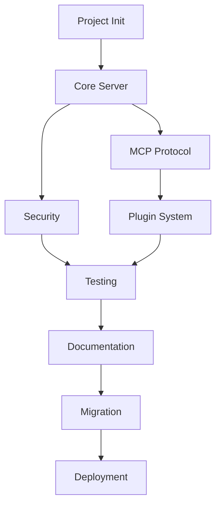

# Task List: Waygate MCP Implementation

**Generated from:** PRD-00-waygate-mcp-framework.md
**Date:** 2025-01-14
**Total Tasks:** 45
**Estimated Hours:** 80-120

## Phase 1: Foundation Setup (Week 1)

### 1.1 Project Initialization
- [ ] **TASK-001:** Create project directory structure (1h)
  - Create waygate-mcp directory
  - Set up src/, tests/, docs/, scripts/, configs/ folders
  - Initialize Git repository with .gitignore

- [ ] **TASK-002:** Set up Python virtual environment (1h)
  - Create venv with Python 3.9+
  - Create requirements.txt with core dependencies
  - Create requirements-dev.txt with dev dependencies

- [ ] **TASK-003:** Configure environment variables (1h)
  - Create .env file with default configuration
  - Create .env.example for documentation
  - Set up python-dotenv integration

- [ ] **TASK-004:** Set up logging infrastructure (2h)
  - Configure structlog for JSON logging
  - Create log directory structure
  - Implement log rotation configuration

### 1.2 Core Server Implementation
- [ ] **TASK-005:** Implement base FastAPI application (3h)
  - Create main application file (waygate_mcp.py)
  - Set up FastAPI app with metadata
  - Configure CORS middleware
  - Implement exception handlers

- [ ] **TASK-006:** Create configuration management system (2h)
  - Implement Pydantic settings class
  - Add environment variable loading
  - Create configuration validation

- [ ] **TASK-007:** Implement health check endpoints (1h)
  - Create /health endpoint
  - Create /ready endpoint
  - Add component health checks

- [ ] **TASK-008:** Create metrics endpoint (2h)
  - Implement /metrics for Prometheus
  - Add basic application metrics
  - Configure metric collection

### 1.3 Database Setup
- [ ] **TASK-009:** Set up SQLite database (2h)
  - Create database initialization
  - Implement connection pooling
  - Add migration support with Alembic

- [ ] **TASK-010:** Create base models (2h)
  - Define SQLAlchemy models
  - Create database schemas
  - Implement CRUD operations

## Phase 2: MCP Implementation (Week 1-2)

### 2.1 MCP Protocol
- [ ] **TASK-011:** Implement MCP protocol handler (4h)
  - Create protocol parser
  - Implement message validation
  - Add protocol versioning support

- [ ] **TASK-012:** Create MCP command executor (3h)
  - Build command routing system
  - Implement command validation
  - Add response formatting

- [ ] **TASK-013:** Add MCP endpoints (2h)
  - Create /mcp/execute endpoint
  - Create /mcp/status endpoint
  - Implement async command handling

### 2.2 Plugin System
- [ ] **TASK-014:** Design plugin interface (2h)
  - Create abstract base class
  - Define plugin lifecycle methods
  - Document plugin API

- [ ] **TASK-015:** Implement plugin loader (3h)
  - Create dynamic import system
  - Add plugin discovery
  - Implement dependency resolution

- [ ] **TASK-016:** Create plugin registry (2h)
  - Build registration system
  - Add plugin metadata storage
  - Implement plugin queries

- [ ] **TASK-017:** Add plugin configuration (2h)
  - Create per-plugin config system
  - Add config validation
  - Implement config hot-reload

## Phase 3: Security & Authentication (Week 2)

### 3.1 Authentication
- [ ] **TASK-018:** Implement API key authentication (2h)
  - Create API key middleware
  - Add key validation
  - Implement key rotation support

- [ ] **TASK-019:** Add rate limiting (2h)
  - Implement per-client limits
  - Add configurable thresholds
  - Create limit exceeded responses

- [ ] **TASK-020:** Create authorization system (3h)
  - Implement role-based access
  - Add permission checks
  - Create authorization middleware

### 3.2 Security Hardening
- [ ] **TASK-021:** Add request validation (2h)
  - Implement input sanitization
  - Add size limits
  - Create validation middleware

- [ ] **TASK-022:** Implement secure configuration (1h)
  - Add secrets management
  - Implement secure defaults
  - Create security checklist

## Phase 4: Diagnostics & Monitoring (Week 2-3)

### 4.1 Diagnostic Tools
- [ ] **TASK-023:** Create connection diagnostic script (2h)
  - Check server status
  - Verify port availability
  - Test endpoint connectivity

- [ ] **TASK-024:** Build performance diagnostic tool (3h)
  - Monitor CPU/memory usage
  - Measure response times
  - Create performance reports

- [ ] **TASK-025:** Implement log analyzer (3h)
  - Parse JSON logs
  - Correlate errors
  - Generate insights

### 4.2 Monitoring Integration
- [ ] **TASK-026:** Add OpenTelemetry support (3h)
  - Configure tracing
  - Add span creation
  - Implement context propagation

- [ ] **TASK-027:** Create custom metrics (2h)
  - Define business metrics
  - Add metric collectors
  - Configure exporters

- [ ] **TASK-028:** Build alerting rules (2h)
  - Define alert conditions
  - Create alert templates
  - Configure notifications

## Phase 5: Testing & Quality (Week 3)

### 5.1 Testing Framework
- [ ] **TASK-029:** Set up pytest framework (1h)
  - Configure pytest
  - Add coverage reporting
  - Create test structure

- [ ] **TASK-030:** Write unit tests for core (4h)
  - Test server initialization
  - Test configuration
  - Test basic endpoints

- [ ] **TASK-031:** Create integration tests (4h)
  - Test MCP protocol
  - Test plugin system
  - Test database operations

- [ ] **TASK-032:** Add performance tests (2h)
  - Create load tests
  - Benchmark endpoints
  - Profile code

### 5.2 Code Quality
- [ ] **TASK-033:** Configure linting tools (1h)
  - Set up black, isort, flake8
  - Create pre-commit hooks
  - Add mypy type checking

- [ ] **TASK-034:** Create CI/CD pipeline (3h)
  - Set up GitHub Actions
  - Add test automation
  - Configure deployment

## Phase 6: Documentation (Week 3)

### 6.1 User Documentation
- [ ] **TASK-035:** Write installation guide (2h)
  - Document prerequisites
  - Create step-by-step instructions
  - Add troubleshooting section

- [ ] **TASK-036:** Create API documentation (3h)
  - Generate OpenAPI spec
  - Document endpoints
  - Add usage examples

- [ ] **TASK-037:** Write plugin development guide (3h)
  - Document plugin interface
  - Create example plugin
  - Add best practices

### 6.2 Operational Documentation
- [ ] **TASK-038:** Create diagnostic playbooks (3h)
  - Document common issues
  - Add resolution steps
  - Create decision trees

- [ ] **TASK-039:** Write deployment guide (2h)
  - Document deployment options
  - Add configuration guide
  - Create rollback procedures

## Phase 7: Migration & Deployment (Week 4)

### 7.1 Migration from NEXUS
- [ ] **TASK-040:** Create migration script (3h)
  - Export NEXUS config
  - Transform to Waygate format
  - Validate migration

- [ ] **TASK-041:** Write migration guide (2h)
  - Document process
  - Add verification steps
  - Create rollback plan

### 7.2 Production Deployment
- [ ] **TASK-042:** Create systemd service (1h)
  - Write service file
  - Add auto-restart
  - Configure logging

- [ ] **TASK-043:** Set up monitoring (2h)
  - Deploy Prometheus
  - Configure alerts
  - Create dashboards

- [ ] **TASK-044:** Perform load testing (2h)
  - Run stress tests
  - Validate performance
  - Document results

- [ ] **TASK-045:** Execute production deployment (2h)
  - Deploy to production
  - Verify functionality
  - Monitor initial operation

## Task Prioritization

### P0 - Critical Path (Must Complete)
- TASK-001 to TASK-008 (Foundation)
- TASK-011 to TASK-013 (MCP Core)
- TASK-018 to TASK-019 (Security)
- TASK-029 to TASK-031 (Testing)
- TASK-035 to TASK-036 (Documentation)

### P1 - Important (Should Complete)
- TASK-014 to TASK-017 (Plugin System)
- TASK-023 to TASK-025 (Diagnostics)
- TASK-040 to TASK-041 (Migration)

### P2 - Nice to Have (Could Complete)
- TASK-026 to TASK-028 (Advanced Monitoring)
- TASK-032 (Performance Tests)
- TASK-043 to TASK-044 (Production Monitoring)

## Dependencies

## Resource Requirements

### Developer Time
- **Senior Developer:** 80-100 hours
- **Documentation:** 10-15 hours
- **Testing/QA:** 15-20 hours

### Infrastructure
- Development VM
- Testing environment
- Production VM
- Monitoring stack

## Success Metrics

- [ ] All P0 tasks completed
- [ ] 80% test coverage achieved
- [ ] < 100ms response time verified
- [ ] Migration from NEXUS successful
- [ ] Production deployment stable

---

**Task Tracking**
- Total Tasks: 45
- Estimated Hours: 80-120
- Sprint Duration: 4 weeks
- Team Size: 1-2 developers